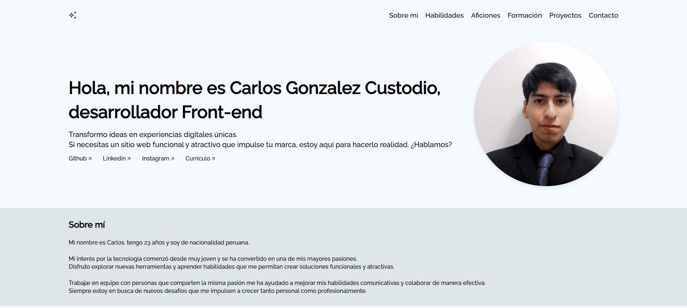

# Portafolio Personal  

Bienvenido a mi portafolio personal. Este proyecto es una página web diseñada para mostrar información sobre mi trayectoria profesional, habilidades, aficiones, formación y proyectos.  

## 📋 Tabla de Contenidos
- [Presentacion](#presentacion) 
- [Tabla de contenidos](#tabla-de-contenidos)   
- [Características](#características)  
- [Tecnologías Utilizadas](#tecnologías-utilizadas)   
- [Vista Previa](#vista-previa)  

## ✨ Características  
- Navegación intuitiva con enlaces hacia secciones clave.  
- Animaciones suaves al desplazarse hacia secciones específicas.  
- Diseño adaptable para pantallas de escritorio, tablet y dispositivos móviles.  
- Código modular y organizado para facilitar la personalización.  

## 💻 Tecnologías Utilizadas  
- **HTML**: Para la estructura de la página.  
- **CSS**: Para los estilos y la transición suave en la navegación.  
- **JavaScript**: Para agregar interactividad avanzada.  

## 🖼️ Vista Previa

Hecho con ❤️ por Carlos Alberto Gonzalez Custodio